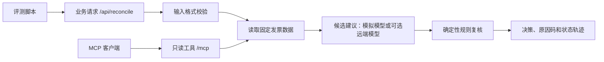

# Java to FDE Starter Kit

[English](README.en.md) · [学习路线](ROADMAP.md) · [参与贡献](CONTRIBUTING.md) · [Apache-2.0 许可](LICENSE)

一个能在本机运行的 Java 入门项目：用发票核对场景练习 **受控工具调用、确定性兜底、故障注入和业务评测**。它把「接口返回成功」与「业务决策正确」分开验证。默认使用本地模拟模型和固定测试数据，不需要 API Key、数据库或 Docker。

这个仓库是教学示例，适合读代码、改规则、跑反例。当前数据和安全边界只覆盖本机演练。

## 5 分钟跑起来

需要 Java 17、Maven 3.6.3+ 和 Python 3。项目使用 Spring Boot 3.5.16、Spring AI 1.1.8；[Spring AI 1.1 文档](https://docs.spring.io/spring-ai/reference/1.1/getting-started.html)列明其支持 Spring Boot 3.4/3.5，[Spring Boot 文档](https://docs.spring.io/spring-boot/3.5/system-requirements.html)列明 Java 17 为最低版本。

```bash
cd java-to-fde-starter-kit
mvn test
mvn spring-boot:run
```

应用默认只监听 `127.0.0.1:8080`。在另一个终端请求业务接口：

```bash
curl -sS http://127.0.0.1:8080/api/reconcile \
  -H 'Content-Type: application/json' \
  -d '{"tenantId":"acme","query":"请核对发票 INV-1001","demoFault":"NONE"}'
```

响应包含 `decision`、`reasonCode`、`reason`、`states`、`traceId`、`durationMs` 和 `guardOverrodeModel`。`decision` 只会是 `READY_FOR_REVIEW` 或 `MANUAL_REVIEW`：即使得到正常候选结论，系统也只把发票送入人工复核队列，不在示例里执行付款或记账。

同样是 HTTP 200，业务结果可能不同：

| 演示输入 | `decision` | `reasonCode` | 最后状态 |
| --- | --- | --- | --- |
| `INV-1001` + `NONE` | `READY_FOR_REVIEW` | `MATCHED` | `COMPLETED` |
| `INV-1002` + `OVERAPPROVE` | `MANUAL_REVIEW` | `AMOUNT_MISMATCH` | `COMPLETED` |
| `INV-1001` + `TIMEOUT` | `MANUAL_REVIEW` | `MODEL_TIMEOUT` | `FALLBACK` |

运行评测（应用需保持启动）：

```bash
python3 eval/run.py
python3 scripts/mcp_smoke.py
```

业务评测针对最终决策和原因码进行断言；MCP 验收脚本会完成握手、列工具、读取合成发票，并检查非法 `Origin` 被拒绝。两者的退出码可用于 CI，且只依赖 Python 标准库。业务用例位于 [`eval/cases.jsonl`](eval/cases.jsonl)，结果写入 `eval/reports/last-run.json`。保持默认模拟模式运行时没有模型调用费用。

## 看什么



- **状态轨迹**：`states` 展示一次请求经过的步骤。候选建议超时或格式异常时会进入 `FALLBACK`；发票金额不符等业务拒绝会正常完成并返回 `MANUAL_REVIEW`。
- **业务护栏**：候选建议只是输入之一。是否允许进入复核由 Java 规则决定；`guardOverrodeModel` 标记候选建议被规则覆盖的情况。
- **MCP 工具**：Spring AI WebMVC starter 提供 Streamable HTTP `/mcp`，发布只读的固定数据查询工具。[官方文档](https://docs.spring.io/spring-ai/reference/1.1/api/mcp/mcp-streamable-http-server-boot-starter-docs.html)说明了该 starter、`STREAMABLE` 配置和默认端点。可将 `http://127.0.0.1:8080/mcp` 配给支持 Streamable HTTP 的 MCP 客户端。使用其他本地浏览器来源时，可通过 `FDE_MCP_ALLOWED_ORIGINS` 配置逗号分隔的允许来源；该校验覆盖本地应用的所有 HTTP 路由。
- **故障注入**：默认模拟模式下，`demoFault` 用于复现边界情况。`NONE` 为正常路径；`TIMEOUT`、`MALFORMED`、`OVERAPPROVE` 分别演示候选建议超时、格式异常和过度批准。它只用于本地练习。

## 切换为真实模型调用

默认模拟模式可完整运行项目和评测。若要试用 OpenAI 兼容接口，先在运行环境提供 `FDE_LLM_API_KEY`，然后设置下列变量再启动应用：

```bash
export FDE_MODEL_PROVIDER=openai
export FDE_LLM_BASE_URL=https://api.openai.com/v1
export FDE_LLM_MODEL=<your-model>
export FDE_LLM_TIMEOUT_MS=3000
mvn spring-boot:run
```

远端模式会产生真实网络请求，可能产生费用；不同服务商的兼容程度需自行验证。密钥只通过环境变量提供，不要写进仓库。跑固定回归用例时使用默认模拟模式，避免外部模型波动影响基线。

## 从示例走向真实场景

这个仓库刻意把场景收窄到「读取固定发票 → 产生候选建议 → Java 规则复核 → 返回可解释结论」。要接入真实客户系统，需要先替换固定数据，再逐步补齐以下边界：

1. 在可信入口完成用户身份验证，并把租户身份与授权范围绑定到服务端上下文；不能信任请求体里的 `tenantId` 作为权限依据。
2. 为 `/mcp` 增加认证与工具级授权，审查每个工具的读写范围。示例已有回环地址绑定和 `Origin` 允许列表，但没有身份认证或授权。Spring AI MCP HTTP starter 不自带这些控制；[MCP 传输规范](https://modelcontextprotocol.io/specification/2025-11-25/basic/transports)说明了 `Origin` 校验和本地绑定要求。
3. 将业务数据、幂等键、决策记录和审计轨迹写入可靠存储，并对接现有事务边界。
4. 在脱敏真实样本上维护评测集，覆盖权限越界、脏数据、超时和规则变更。将业务通过率、兜底率与耗时纳入发布门槛和监控。

欢迎从一个反例或一个新的只读工具开始贡献；[ROADMAP.md](ROADMAP.md)列出逐步演进的验收条件与入门任务，具体提交要求见 [CONTRIBUTING.md](CONTRIBUTING.md)。
